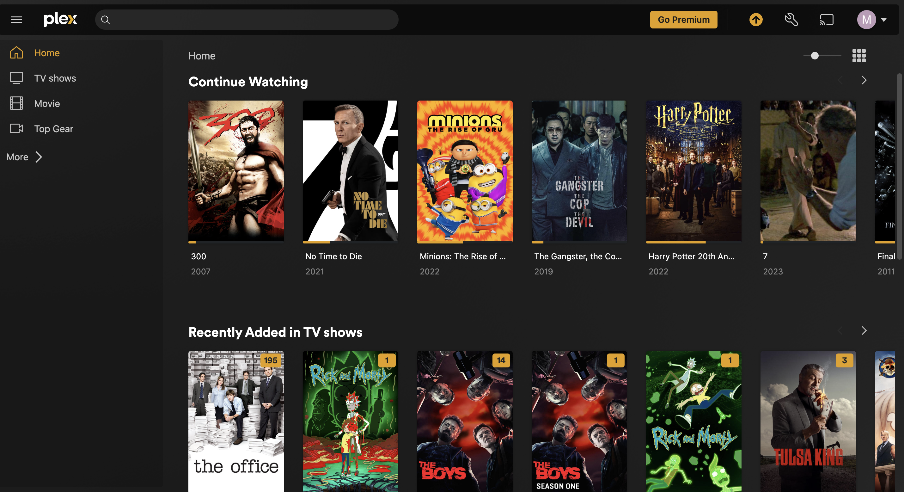
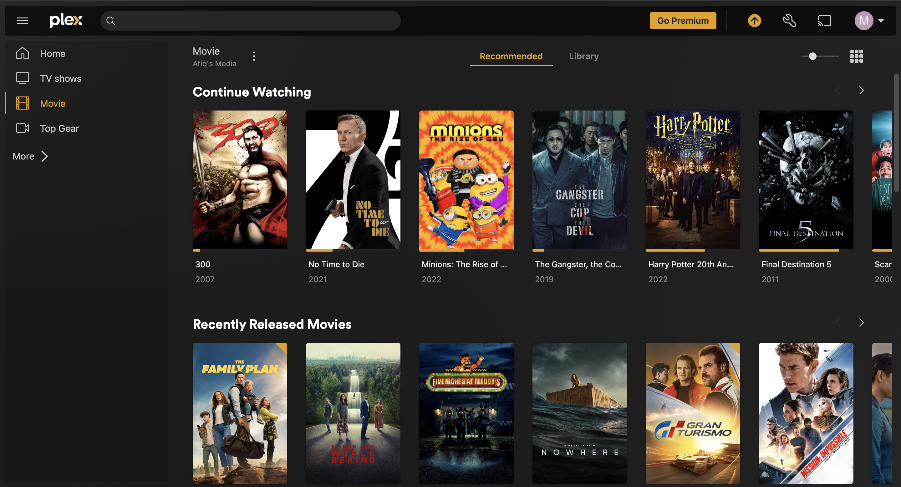
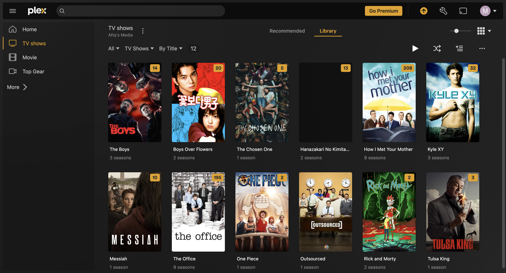

# PlexMediaServer
Running PlexMediaServer on Raspberry pi 4

## 1) Create folder
```
mkdir plex_media
```
## 2) Change mod
```
chmod 777 /plex_media/
```
## 3) Mount storage & make as permanently mount

```
lsblk
```

```
NAME        MAJ:MIN RM  SIZE RO TYPE MOUNTPOINT
sda           8:0    0  2.7T  0 disk 
└─sda1        8:1    0  2.7T  0 part 
mmcblk0     179:0    0 29.7G  0 disk 
├─mmcblk0p1 179:1    0  256M  0 part /boot
└─mmcblk0p2 179:2    0 29.5G  0 part /
 ```

*screcchot lsblk

```
mount dev/sda1 /plex_media/
```
```
NAME        MAJ:MIN RM  SIZE RO TYPE MOUNTPOINT
sda           8:0    0  2.7T  0 disk 
└─sda1        8:1    0  2.7T  0 part /plex_media
mmcblk0     179:0    0 29.7G  0 disk 
├─mmcblk0p1 179:1    0  256M  0 part /boot
└─mmcblk0p2 179:2    0 29.5G  0 part /
```

Get universally unique identifiers (UUIDs)
```
blkid
```

output will be link this
```
/dev/mmcblk0p1: LABEL_FATBOOT="bootfs" LABEL="bootfs" UUID="0B22-2966" BLOCK_SIZE="512" TYPE="vfat" PARTUUID="11b4e0bb-01"
/dev/mmcblk0p2: LABEL="rootfs" UUID="3ad7386b-e1ae-4032-ae33-0c40f5ecc4ac" BLOCK_SIZE="4096" TYPE="ext4" PARTUUID="11b4e0bb-02"
/dev/sda1: LABEL="Picture_Archived" BLOCK_SIZE="4096" UUID="8C1AAF0E1AAEF47C" TYPE="ntfs"
```

```
nano /etc/fstab
```

```
UUID=8C1AAF0E1AAEF47C   /plex_media     ntfs    defaults,auto,rw,nofail 0  1
```

## 4) Update repo
```
apt update && upgrade -y
```

## 5) Samba setting

```
apt install samba samba-common-bin && apt install ntfs-3g
```

Do configuration in samba setting
```
sudo nano /etc/samba/smb.conf
```

Save this setting at bottom of configuration
```
[Pi Plex Share]
path = /plex/media
writeable=Yes
create mask = 0777
directory mask = 0777
public = Yes
```

## 6) Restart service
```
sudo systemctl restart smbd.service
sudo systemctl restart nmbd.service
```

## 7) Start install plex server
```
sudo apt-get install apt-transport-https
curl https://downloads.plex.tv/plex-keys/PlexSign.key | sudo apt-key add -
echo deb https://downloads.plex.tv/repo/deb public main | sudo tee /etc/apt/sources.list.d/plexmediaserver.list
sudo apt-get update
sudo apt install plexmediaserver
```

once all done check service status ```systemctl status plexmediaserver```

## 8) Open PlexServer from website

Please use this URL for accessing Plex Server `http://<local_ip>:32400/web/index.html#!`

```
http://192.168.68.100:32400/web/index.html#!
```


## Project Name

Description of your project.

### Screenshots


*Caption for Image 1*


*Caption for Image 2*


*Caption for Image 3*


